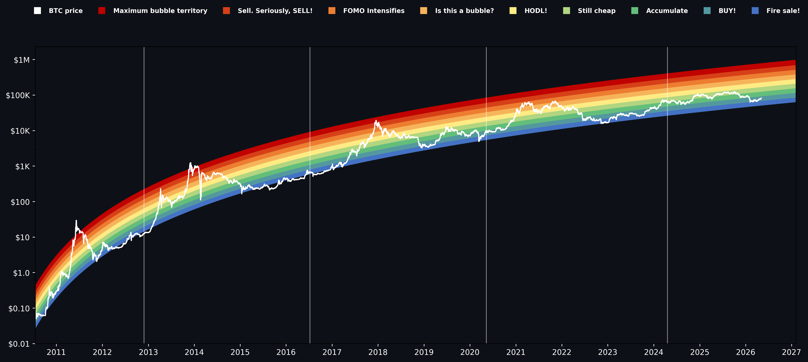

# Bitcoin rainbow chart

Small Python tool that plots the classic **log-scale rainbow bands** over BTC/USD with an **interactive** chart (hover any date to see each band’s upper/lower price), or export PNG/HTML.

**Data:** daily closes from [CryptoCompare](https://www.cryptocompare.com/) (`histoday`), from **2009-01-02** through today. Days before the API has prices are stored as `0` and skipped for the fit (same idea as the bundled CSV).

## Interactive chart (GitHub)

GitHub’s file preview does **not** run JavaScript, so [`img/chart.html`](img/chart.html) will not be interactive if you only click it in the repo browser. Use one of these instead:

[](https://raw.githack.com/poboisvert/launch-startups-backlinks-crypto-market/main/rainbow_chart_btc2/img/chart.html)

**Direct link:** [https://raw.githack.com/poboisvert/launch-startups-backlinks-crypto-market/main/rainbow_chart_btc2/img/chart.html](https://raw.githack.com/poboisvert/launch-startups-backlinks-crypto-market/main/rainbow_chart_btc2/img/chart.html)

- Hover the chart to see the **date** at the top and **all band prices** in the bar at the bottom.
- Click legend items to show or hide bands; zoom and pan as usual.

To refresh the hosted chart after updating data, regenerate the file and push:

```bash
cd rainbow_chart_btc2
source .venv/bin/activate
python src/main.py --html img/chart.html
git add img/chart.html && git commit -m "Update interactive chart" && git push
```

## Preview (static)



## Setup

Use a virtual environment (recommended on macOS):

```bash
cd rainbow_chart_btc2
python3 -m venv .venv
source .venv/bin/activate   # Windows: .venv\Scripts\activate
pip install -r requirements.txt
```

Run commands from the **`rainbow_chart_btc2`** folder so paths like `data/bitcoin_data.csv` resolve.

## Run

```bash
python src/main.py
```

Opens the interactive chart in your browser.

```bash
python src/main.py --html img/chart.html
```

Writes a standalone `img/chart.html` (same file linked above for GitHub).

```bash
python src/main.py --save
```

Writes `img/bitcoin_rainbow_chart.png` (static matplotlib image).

```bash
python src/main.py --full-refresh
```

Re-downloads the full daily series and overwrites `data/bitcoin_data.csv` (can take a bit; CryptoCompare rate limits apply).

## Credits

Based on [StephanAkkerman/bitcoin-rainbow-chart](https://github.com/StephanAkkerman/bitcoin-rainbow-chart). Rainbow idea and similar charts: [LookIntoBitcoin](https://www.lookintobitcoin.com/charts/bitcoin-rainbow-chart/), [Blockchain Center](https://www.blockchaincenter.net/en/bitcoin-rainbow-chart/).
